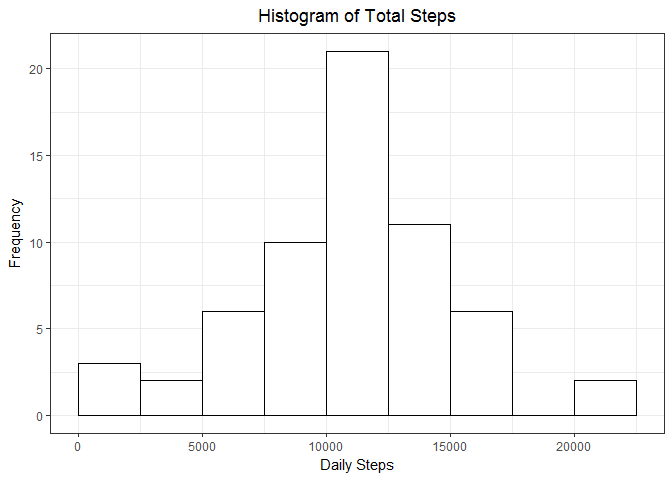
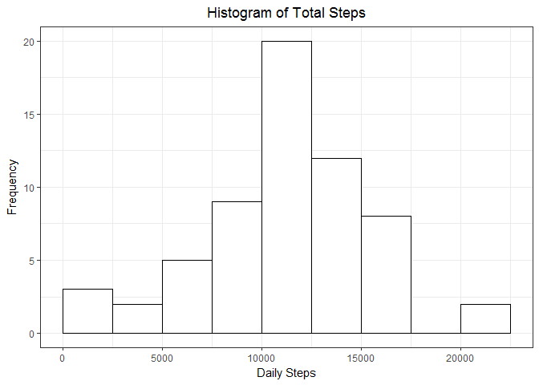

## R Markdown

This is an R Markdown document for the Reproducible Research Project 1. This markdown reads the activity.csv file and performs some exploratory analysis.


The libraries used for this project: `tidyverse`, `lubridate` and `mice`. `tidyverse` contains many of the packages we need like `dplyr`, `ggplot2` and `readr`.

```r
if(!require(tidyverse)) {install.packages('tidyverse'); require(tidyverse)}
if(!require(lubridate)) {install.packages('lubridate'); require(lubridate)}
if(!require(mice)) {install.packages('mice'); require(mice)}
```

We'll set the working directory

```r
setwd('~/Coursera/Reproducible Research/Project 1')
```

The following will check if the `activity.csv` file exists in the working directory. If it doesn't exist, then it will download and unzip the file. If the activity.csv does exist, `"file exists"` will be printed.

```r
if(!'activity.csv' %in% list.files('~/Coursera/Reproducible Research/Project 1')){
  download.file('https://d396qusza40orc.cloudfront.net/repdata%2Fdata%2Factivity.zip',
                path.expand('~/Coursera/Reproducible Research/Project 1/activity'))
  unzip('~/Coursera/Reproducible Research/Project 1/household_power.zip',
        exdir = '~/Coursera/Reproducible Research/Project 1')
} else {
  print('file exists')
}
```

```
## [1] "file exists"
```

##### 1) Code for reading in the dataset and/or processing the data
The following code will read the activity.csv

```r
df <- read.csv('activity.csv')
head(df)
```

```
##   steps       date interval
## 1    NA 2012-10-01        0
## 2    NA 2012-10-01        5
## 3    NA 2012-10-01       10
## 4    NA 2012-10-01       15
## 5    NA 2012-10-01       20
## 6    NA 2012-10-01       25
```

Alternatively the `read_csv` can from the `readr` package can be used after loading the `readr` package. The `read_csv` function is faster than the `read.csv` function. Additionally the `read_csv` function assigns the correct date class to the date column. `read.csv` assigned factor to date.

```r
df <- read_csv('activity.csv')
```

```
## Parsed with column specification:
## cols(
##   steps = col_integer(),
##   date = col_date(format = ""),
##   interval = col_integer()
## )
```

```r
head(df)
```

```
## # A tibble: 6 x 3
##   steps       date interval
##   <int>     <date>    <int>
## 1    NA 2012-10-01        0
## 2    NA 2012-10-01        5
## 3    NA 2012-10-01       10
## 4    NA 2012-10-01       15
## 5    NA 2012-10-01       20
## 6    NA 2012-10-01       25
```

##### 2) Histogram of the total number of steps taken each day

First we can create a new data.frame of the steps taken each day. The `dplyr` package is used for this. We can pipe the df with `%>%`. The `group_by(date)` groups the date variable together other functions. The `summarise(daily_steps = sum(steps))` sums the `steps` grouped by `date` into a new column named  `daily_steps`.

```r
df_2 <- df %>% 
  group_by(date) %>% 
  summarise(daily_steps = sum(steps)) 
head(df_2)
```

```
## # A tibble: 6 x 2
##         date daily_steps
##       <date>       <int>
## 1 2012-10-01          NA
## 2 2012-10-02         126
## 3 2012-10-03       11352
## 4 2012-10-04       12116
## 5 2012-10-05       13294
## 6 2012-10-06       15420
```

We use `ggplot`'s `geom_histogram` to create a histogram of the dayly steps.

```r
df_2_plot <- ggplot(df_2, aes(daily_steps)) + 
  geom_histogram(binwidth = 2500, boundary = 0, colour = 'black', fill = 'white') +
  labs(title = 'Histogram of Daily Steps', x = 'Daily Steps', y = 'Frequency') + 
  theme_bw() + 
  theme(plot.title = element_text(hjust = 0.5))
df_2_plot  
```

<!-- -->

#### 3) Mean and median number of steps taken each day

We can create a daily mean & median similarly to how we created the daily totals. Using `summarise` from `dplyr`, `mean` and `median` from the `base` and `stats` packages, the mean and median can be calculated.

```r
df_3 <- df %>% 
  group_by(date) %>% 
  summarise(mean_steps = mean(steps),
            median_steps = median(steps))
head(df_3)
```

```
## # A tibble: 6 x 3
##         date mean_steps median_steps
##       <date>      <dbl>        <dbl>
## 1 2012-10-01         NA           NA
## 2 2012-10-02    0.43750            0
## 3 2012-10-03   39.41667            0
## 4 2012-10-04   42.06944            0
## 5 2012-10-05   46.15972            0
## 6 2012-10-06   53.54167            0
```

##### 4) Time series plot of the average number of steps taken

We use the mean and median on the data.frame from #3. `geom_line` from `ggplot` is called for this plot.

```r
df_4_plot <- ggplot(df_3, aes(date, mean_steps)) + 
  geom_line() +
  labs(title = 'Average Number of Steps Taken Per Day', 
       x = 'Date', y = 'Average Steps') + 
  theme_bw() + 
  theme(plot.title = element_text(hjust = 0.5))
df_4_plot
```

<!-- -->

##### 5) The 5-minute interval that, on average, contains the maximum number of steps

For this part we find the max steps for each interval first. Then use `top_n(1, max_steps)` to find the interval with the highest step.

```r
df_5 <- df %>% 
  group_by(interval) %>% 
  summarise(max_steps = max(steps, na.rm = TRUE)) %>% 
  top_n(1, max_steps)
df_5
```

```
## # A tibble: 1 x 2
##   interval max_steps
##      <int>     <dbl>
## 1      615       806
```

##### 6) Code to describe and show a strategy for imputing missing data
We'll impute the missing values with the `mice` package. First we convert the columns to numeric. 

```r
df_6 <- df %>% 
  mutate_all(as.numeric)
```
Then we apply the `mice` and `complete` functions from the `mice` package. Finally we convert the `date` column back to date format.

```r
df_6 <- complete(mice(df_6)) %>% 
  mutate(date = as_date(date, origin = lubridate::origin))
```

```
## 
##  iter imp variable
##   1   1  steps
##   1   2  steps
##   1   3  steps
##   1   4  steps
##   1   5  steps
##   2   1  steps
##   2   2  steps
##   2   3  steps
##   2   4  steps
##   2   5  steps
##   3   1  steps
##   3   2  steps
##   3   3  steps
##   3   4  steps
##   3   5  steps
##   4   1  steps
##   4   2  steps
##   4   3  steps
##   4   4  steps
##   4   5  steps
##   5   1  steps
##   5   2  steps
##   5   3  steps
##   5   4  steps
##   5   5  steps
```

##### 7) Histogram of the total number of steps taken each day after missing 
First we'll create a data.frame that has the added steps for each day.

```r
df_7 <- df_6 %>% 
  group_by(date) %>% 
  summarise(total_steps = sum(steps))
head(df_7)
```

```
## # A tibble: 6 x 2
##         date total_steps
##       <date>       <dbl>
## 1 2012-10-01        9753
## 2 2012-10-02         126
## 3 2012-10-03       11352
## 4 2012-10-04       12116
## 5 2012-10-05       13294
## 6 2012-10-06       15420
```


```r
df_7_plot <- ggplot(df_7, aes(total_steps)) + 
  geom_histogram(binwidth = 2500, boundary = 0, colour = 'black', fill = 'white') +
  labs(title = 'Histogram of Total Steps', x = 'Daily Steps', y = 'Frequency') + 
  theme_bw() + 
  theme(plot.title = element_text(hjust = 0.5))
df_7_plot  
```

<!-- -->


##### 8) Panel plot comparing the average number of steps taken per 5-minute interval across weekdays and weekends

For this step, we need transform the dates to weekend or weekday. We can use the `lubridate` package to do this. Passing the `date` variable through the `wday` function returns the integer value of the day. 7 = Sunday, 1 = Monday, 2 = Tuesday, etc. The weekend values are 1 (Sunday) and 7 (Saturday). The weekday values are 2:6 (Monday:Friday).

```r
df_8 <- df %>% 
  mutate(day = case_when(
    wday(date) %in% c(1,7) ~ 'Weekend',
    wday(date) %in% 2:6 ~ 'Weekday')) %>% 
  group_by(interval, day) %>% 
  summarise(average_steps = mean(steps, na.rm = TRUE))
head(df_8)
```

```
## # A tibble: 6 x 3
## # Groups:   interval [3]
##   interval     day average_steps
##      <int>   <chr>         <dbl>
## 1        0 Weekday     2.3333333
## 2        0 Weekend     0.0000000
## 3        5 Weekday     0.4615385
## 4        5 Weekend     0.0000000
## 5       10 Weekday     0.1794872
## 6       10 Weekend     0.0000000
```

We then create the plot with `ggplot`. We can facet the weekday and weekend with `facet_grid`. Placing the `day` variable on the left of the tilde (~) plots the two on top of each other. Placing the `day` variable on the right of the tilde plots the two side by side.

```r
df_8_plot <- ggplot(df_8, aes(interval, average_steps)) +
  geom_line() + 
  facet_grid(day ~ .) +
  theme_bw()
df_8_plot
```

<!-- -->

##### 9) All of the R code needed to reproduce the results (numbers, plots, etc.) in the report1

```r
# load tidyverse and readr packages
if(!require(tidyverse)) {install.packages('tidyverse'); require(tidyverse)}
if(!require(lubridate)) {install.packages('lubridate'); require(lubridate)}
if(!require(mice)) {install.packages('mice'); require(mice)}

# set working directory
setwd('~/Coursera/Reproducible Research/Project 1')

# if power file doesn't exist then download and unzip else print 'file exists'
if(!'activity.csv' %in% list.files('~/Coursera/Reproducible Research/Project 1')){
  download.file('https://d396qusza40orc.cloudfront.net/repdata%2Fdata%2Factivity.zip',
                path.expand('~/Coursera/Reproducible Research/Project 1/activity'))
  unzip('~/Coursera/Reproducible Research/Project 1/household_power.zip',
        exdir = '~/Coursera/Reproducible Research/Project 1')
} else {
  print('file exists')
}
```

```
## [1] "file exists"
```

```r
# 1) Code for reading in the dataset and/or processing the data
df <- read_csv('activity.csv')
```

```
## Parsed with column specification:
## cols(
##   steps = col_integer(),
##   date = col_date(format = ""),
##   interval = col_integer()
## )
```

```r
# 2) Histogram of the total number of steps taken each day

# Total steps by date
df_2 <- df %>% 
  group_by(date) %>% 
  summarise(daily_steps = sum(steps)) 
head(df_2)
```

```
## # A tibble: 6 x 2
##         date daily_steps
##       <date>       <int>
## 1 2012-10-01          NA
## 2 2012-10-02         126
## 3 2012-10-03       11352
## 4 2012-10-04       12116
## 5 2012-10-05       13294
## 6 2012-10-06       15420
```

```r
# Histogram of daily steps
df_2_plot <- ggplot(df_2, aes(daily_steps)) + 
  geom_histogram(binwidth = 2500, boundary = 0, colour = 'black', fill = 'white') +
  labs(title = 'Histogram of Daily Steps', x = 'Daily Steps', y = 'Frequency') + 
  theme_bw() + 
  theme(plot.title = element_text(hjust = 0.5))
df_2_plot  
```

```
## Warning: Removed 8 rows containing non-finite values (stat_bin).
```

<!-- -->

```r
# 3) Mean and median number of steps taken each day
df_3 <- df %>% 
  group_by(date) %>% 
  summarise(mean_steps = mean(steps),
            median_steps = median(steps))
head(df_3)
```

```
## # A tibble: 6 x 3
##         date mean_steps median_steps
##       <date>      <dbl>        <dbl>
## 1 2012-10-01         NA           NA
## 2 2012-10-02    0.43750            0
## 3 2012-10-03   39.41667            0
## 4 2012-10-04   42.06944            0
## 5 2012-10-05   46.15972            0
## 6 2012-10-06   53.54167            0
```

```r
# 4) Time series plot of the average number of steps taken
df_4_plot <- ggplot(df_3, aes(date, mean_steps)) + 
  geom_line() +
  labs(title = 'Average Number of Steps Taken Per Day', 
       x = 'Date', y = 'Average Steps') + 
  theme_bw() + 
  theme(plot.title = element_text(hjust = 0.5))
df_4_plot
```

```
## Warning: Removed 2 rows containing missing values (geom_path).
```

<!-- -->

```r
# 5) The 5-minute interval that, on average, contains the maximum number of steps
df_5 <- df %>% 
  group_by(interval) %>% 
  summarise(max_steps = max(steps, na.rm = TRUE)) %>% 
  top_n(1, max_steps)
df_5
```

```
## # A tibble: 1 x 2
##   interval max_steps
##      <int>     <dbl>
## 1      615       806
```

```r
# 6) Code to describe and show a strategy for imputing missing data

# Convert all columns to numeric for mice
df_6 <- df %>% 
  mutate_all(as.numeric)

# Insert imputed missing values with mice & complete functions from mice package. 
df_6 <- complete(mice(df_6)) %>% 
  # Convert date to date format. Re-insert to date column
  mutate(date = as_date(date, origin = lubridate::origin))
```

```
## 
##  iter imp variable
##   1   1  steps
##   1   2  steps
##   1   3  steps
##   1   4  steps
##   1   5  steps
##   2   1  steps
##   2   2  steps
##   2   3  steps
##   2   4  steps
##   2   5  steps
##   3   1  steps
##   3   2  steps
##   3   3  steps
##   3   4  steps
##   3   5  steps
##   4   1  steps
##   4   2  steps
##   4   3  steps
##   4   4  steps
##   4   5  steps
##   5   1  steps
##   5   2  steps
##   5   3  steps
##   5   4  steps
##   5   5  steps
```

```r
# 7) Histogram of the total number of steps taken each day after missing 
# values are imputed

# Total steps by day after imputing missing values
df_7 <- df_6 %>% 
  group_by(date) %>% 
  summarise(total_steps = sum(steps))

# Histogram of total steps 
df_7_plot <- ggplot(df_7, aes(total_steps)) + 
  geom_histogram(binwidth = 2500, boundary = 0, colour = 'black', fill = 'white') +
  labs(title = 'Histogram of Total Steps', x = 'Daily Steps', y = 'Frequency') + 
  theme_bw() + 
  theme(plot.title = element_text(hjust = 0.5))
df_7_plot  
```

<!-- -->

```r
# 8) Panel plot comparing the average number of steps taken per 5-minute 
# interval across weekdays and weekends

# Label dates as weekend and weekday. Average by interval and weekend/weekday
df_8 <- df %>% 
  mutate(day = case_when(
    wday(date) %in% c(1,7) ~ 'Weekend',
    wday(date) %in% 2:6 ~ 'Weekday')) %>% 
  group_by(interval, day) %>% 
  summarise(average_steps = mean(steps, na.rm = TRUE))

# Facet plot of average steps by interval. Facetted by weekend vs weekday
df_8_plot <- ggplot(df_8, aes(interval, average_steps)) +
  geom_line() + 
  facet_grid(day ~ .) +
  theme_bw()
df_8_plot
```

<!-- -->
